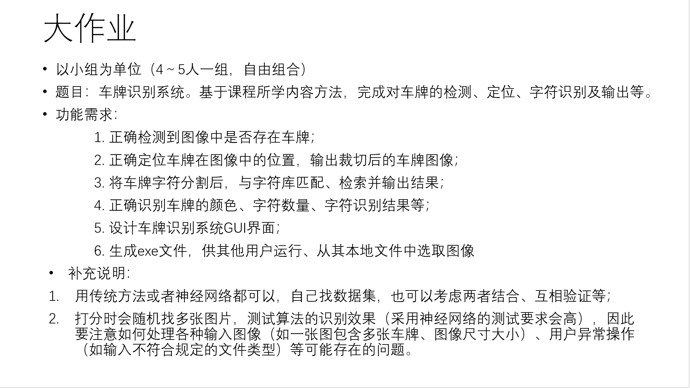
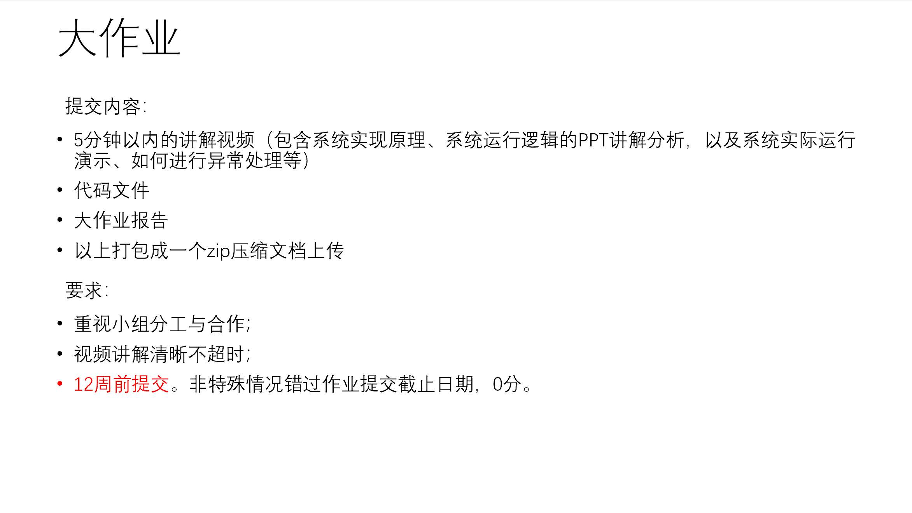

# ICE2607teamProject
## 1.一些链接
- CCPD数据集github链接：
> <a href = "https://github.com/detectRecog/CCPD?tab=readme-ov-file"> CCPD数据库 </a>

- 已经下载好的CCPD数据集交大云盘链接：
> 链接: https://pan.sjtu.edu.cn/web/share/a4afb22d5d891684a71c27c5dfd4a398, 提取码: lnx3

## 2.大作业任务

## 3.AI写的废话
### 这一句不是废话： **其实用vs或者vscode来push很方便**

### 🚨 最核心的规则

**任何人都不要直接往 `main` 分支上提交（push）代码。**

`main` 分支只用来存放所有人合并好的、能正常运行的“最终版本”。

-----

### 1\. 组长的初始设置 (在 GitHub 网页上操作)

在项目开始前，组长需要完成以下设置：

1.  **创建仓库：** 在 GitHub 上创建一个**私有** (Private) 仓库。
2.  **添加组员：** 进入 `Settings` \> `Collaborators`，将所有组员的 GitHub 账号加为协作者。
3.  **保护 `main` 分支（最重要）：**
      * 进入 `Settings` \> `Branches`。
      * 点击 `Add branch protection rule`。
      * 在 "Branch name pattern" 中填入 `main`。
      * 勾选 **"Require a pull request before merging"** (必须通过 PR 才能合并)。
      * 勾选 **"Require approvals"** (需要有人批准)，并将数量设为 `1`。
      * 点击 `Create` 保存。
4.  **添加 `.gitignore` 文件：**
      * 在项目根目录创建一个 `.gitignore` 文件。
      * 这能防止将 IDE 配置 (如 `.vscode/`, `.idea/`)、缓存 (`__pycache__/`) 或大型数据文件 (如 `dataset/`, `.pt`) 传上 GitHub。

-----

### 2\. 组员的协作流程

#### A. 第一次：克隆项目到本地 (仅需一次)

1.  在 GitHub 仓库主页，点击绿色的 `<> Code` 按钮，复制 `HTTPS` 链接。

| 工具 | 操作步骤 |
| :--- | :--- |
| **命令行 (CLI)** | `git clone https://github.com/Lawrenclia/ICE2607teamProject` |
| **VS Code** | 1. 打开“源代码管理” (Source Control) 面板。 2. 点击 **“克隆存储库”** (Clone Repository)。 3. 粘贴链接并选择本地文件夹。 |
| **Visual Studio** | 1. 在启动窗口选择 **“克隆存储库”** (Clone a repository)。 2. 粘贴链接 (存储库位置) 并选择本地路径。 |

#### B. 日常工作流 (每次开发新功能时)

##### 第1步：同步 (保证 `main` 分支最新)

> **目的：** 在开始写新代码前，先获取 GitHub 上 `main` 分支的所有最新更改。

| 工具 | 操作步骤 |
| :--- | :--- |
| **命令行 (CLI)** | 1. `git checkout main` (切换到 main) 2. `git pull origin main` (拉取最新代码) |
| **VS Code** | 1. 点击左下角分支名，选择 `main` 分支。 2. 点击左下角状态栏的**同步按钮** (🔄) 或点击 `...` 菜单选择 **“拉取” (Pull)**。 |
| **Visual Studio** | 1. 打开 “Git 更改” (Git Changes) 窗口。 2. 点击顶部
分支名，选择 `main`。 3. 点击 **“拉取” (Pull)** 按钮 (⬇️)。 |

##### 第2步：创建新分支 (在新分支上工作)

> **目的：** 创建一个属于你自己的“沙盒”，你的所有新代码都在这里写，不会影响 `main`。

| 工具 | 操作步骤 |
| :--- | :--- |
| **命令行 (CLI)** | `git checkout -b [你的新分支名]` (例如: `git checkout -b feature/gui-interface`) |
| **VS Code** | 1. (确保在 `main` 分支上) 点击左下角分支名 (`main`)。 2. 在弹出的菜单中选择 **“创建新分支...”** (Create new branch...)。 3. 输入新分支名 (例如 `feature/gui-interface`) 并按回车。 |
| **Visual Studio** | 1. 在 “Git 更改” 窗口，点击分支名。 2. 选择 **“新建分支”** (New Branch)。 3. 输入新分支名，确保 “基于” (Based on) 选项是 `main`。 |

##### 第3步：编码、提交和推送 (保存你的工作)

> **目的：** 在你的新分支上写代码，并分步骤保存你的进度 (Commit)，最后推送到 GitHub。

| 工具 | 操作步骤 |
| :--- | :--- |
| **命令行 (CLI)** | 1. `git add .` (添加所有修改过的文件) 2. `git commit -m "清晰的提交信息"` (例如: `feat: 完成GUI主窗口布局`) 3. `git push origin [你的分支名]` (例如: `git push origin feature/gui-interface`) |
| **VS Code** | 1. 在“源代码管理”面板，点击文件旁的 `+` 号暂存更改 (等同 `git add`)。 2. 在“消息”框中输入提交信息 (例如 `feat: 完成GUI主窗口布局`)。 3. 点击**对勾 ✓ 按钮** (Commit - 提交)。 4. 点击左下角状态栏的 **“发布分支”** (Publish Branch ☁️) 或**同步按钮** (🔄) (等同 `git push`)。 |
| **Visual Studio** | 1. 在 “Git 更改” 窗口。 2. 在文本框中输入提交信息。 3. 点击 **“全部提交”** (Commit All)。 4. 点击 **“推送”** 按钮 (⬆️)。 |

##### 第4步：创建拉取请求 (Pull Request - PR)

> **目的：** 当你的功能完成后，请求组长/组员检查你的代码，并将其合并到 `main` 分支。

| 工具 | 操作步骤 |
| :--- | :--- |
| **GitHub 网页** | 1. `push` 成功后，打开 GitHub 仓库主页。 2. 点击黄**色提示条**上的 `Compare & pull request` 按钮。 3. 填写标题和描述，在右侧 `Reviewers` 处 @ 你的组员。 |
| **VS Code** | 1. (需要安装 "GitHub Pull Requests and Issues" 扩展) 2. `push` 成功后，右下角会**弹窗提示**创建 PR，点击即可。 3. 或切换到 "GitHub" 面板，点击 `+` 号创建 PR。 |
| **Visual Studio** | 1. `push` 成功后，“Git 更改” 窗口中会出现一个**链接**：“Create a Pull Request”。 2. 点击该链接即可创建。 |

-----

### 3\. 代码审查 (Review) 与合并

1.  **审查 (Review)：** 组员（Reviewer）会收到通知。TA 可以在 **GitHub 网页**上，或直接在 **VS Code / Visual Studio** 的 "GitHub" 面板中查看 PR 的 `Files changed` (文件改动)。
2.  **反馈 (Feedback)：**
      * **如果没问题：** 组员点击 `Review changes` \> `Approve` (批准)。
      * **如果有问题：** 组员会在代码的特定行留言，或点击 `Request changes`。
3.  **修改 (Modify)：** 如果被要求修改，你只需在**本地的同一个分支**上继续修改代码，然后再次 `Commit` 和 `Push` (按 2.B.第3步 操作)。PR 会自动更新。
4.  **合并 (Merge)：**
      * 当 PR 获得批准（并且没有冲突）后，**PR 的创建者**或**组长**可以在 GitHub 网页上点击绿色的 `Merge pull request` 按钮。
      * 你的代码就安全地合并到 `main` 分支了。
      * 合并后，可以安全地删除这个功能分支。

-----

### 4\. 如何解决合并冲突 (Merge Conflicts)

**什么是冲突？** 你和组员修改了**同一个文件的同一行代码**，Git 不知道该保留谁的。

**推荐使用 VS Code / Visual Studio 在本地解决：**

1.  **第1步：更新 `main`**
      * 切换到你本地的 `main` 分支，并 `pull` (拉取) 最新代码。（参见 2.B.第1步）
2.  **第2步：切回你的功能分支**
      * 切换回你正在开发的分支 (例如 `feature/gui-interface`)。（参见 2.B.第2步）
3.  **第3步：合并 `main` 到当前分支**
      * **命令行:** `git merge main`
      * **VS Code:** 打开命令面板 (Ctrl+Shift+P)，输入 `Git: Merge Branch...`，然后选择 `main`。
      * **Visual Studio:** "Git 更改" 窗口 \> 点击分支名 \> "管理分支" \> 找到 `main` 右键 \> "合并到当前分支"。
4.  **第4步：解决冲突 (GUI 界面)**
      * IDE 会立刻提示你 `CONFLICT!`。
      * **VS Code:**
          * 在“源代码管理”面板的 **“合并更改”** (Merge Changes) 列表中，点击冲突的文件。
          * VS Code 会打开一个 **"Merge Editor" (合并编辑器)**。
          * **左边** (Incoming) 是 `main` 上的代码，**右边** (Current) 是你的代码，**下面** (Result) 是最终结果。
          * 在每个冲突块上方，点击 **"Accept Incoming"** (接受 `main` 的) 或 **"Accept Current"** (接受你的) 或 "Accept Both" (两者都接受)。
          * 你也可以直接在**下方的 "Result" 窗口**里手动编辑成最终想要的样子。
          * 解决完所有冲突后，点击右下角的 **"Complete Merge"** (完成合并)。
      * **Visual Studio:**
          * “Git 更改” 窗口会显示冲突。
          * 点击冲突的文件，VS 会打开一个类似的合并编辑器，让你勾选保留哪些更改。
          * 保存你解决冲突后的文件。
5.  **第5步：提交并推送**
      * 当你用 GUI 解决了所有冲突后，文件会自动变为“已暂存”。
      * 你只需要在“消息”框里输入一条 Commit 信息 (例如 `fix: 解决了合并冲突`)，然后**提交 (Commit)**。
      * 最后，**推送 (Push)** 你的分支。现在冲突已经解决了！

